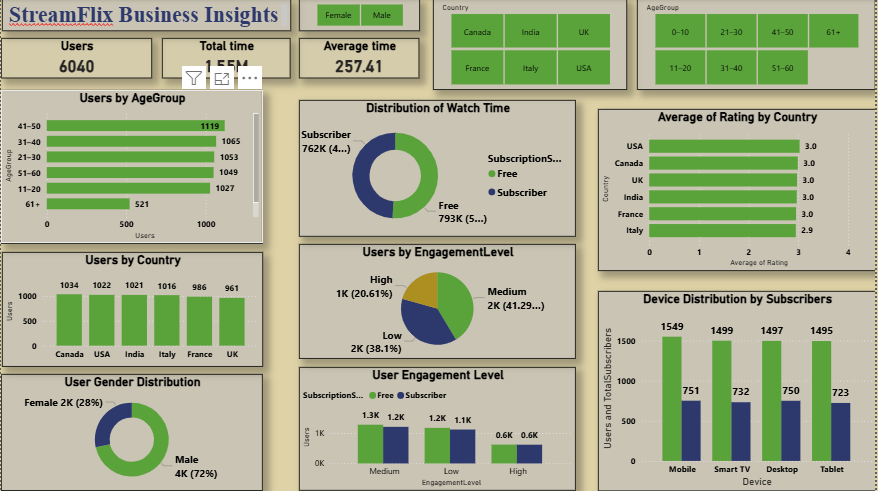

# Data Analyst

## Connect with Me

📞 Phone: [+233240080460](tel:+233240080460)  |✉️ Email: [lmkwao122@gmail.com](mailto:lmkwao122@gmail.com)  

🔗 LinkedIn: [Lydia Kwao](https://www.linkedin.com/in/lydia-kwao112/)  

💻 GitHub: [Lydia-K-dir](https://github.com/Lydia-K-dir)

## About
I am a results-driven Data Analyst with expertise in business intelligence, virtual assistance, and data visualization using Python, SQL, Excel, and Power BI. I specialize in data collection, cleaning, and trend analysis to optimize processes and enhance decision-making. Passionate about leveraging data analytics, I provide actionable insights that drive efficiency and innovation across various sectors. With strong problem-solving and collaboration skills, I translate complex data into strategic solutions that maximize impact.

## Education and Certifications
B.Sc., Nutrition and Food science | The University of Ghana (September 2023)

Generation Data Analyst Graduate April 2025

## Technical Skills: 
Python, SQL, Excel, PowerBI

## Work Experience
**Data Analyst Bootcamp Graduate**  
Generation Ghana (January 2025 - Present) 

- Developed expertise in data analysis, SQL, Python, and visualization tools like Tableau and Power BI.  
- Completed hands-on projects, applying data-driven decision-making to real-world scenarios.  
- Strengthened problem-solving, teamwork, and communication skills through collaborative group projects.  
- Gained proficiency in presenting complex data insights to stakeholders with clarity and confidence.  

## Projects
## StreamFlix Business Insights

### Project Objective:
Provide data-driven insights to support StreamFlix’s transition from a free to paid subscription model.

### Key Business Questions:
- What drives user engagement?
- Which genres and devices attract paid users?
- Who are the ideal candidates for conversion?

### Expected Outcome:
- Provide actionable recommendations to increase subscriptions

### Business Insights

### Recommendations
- Focus conversion on ages 21–50 

- Female-focused campaigns to grow paying users

- Use algorithms to recommend movies based on history, ratings and demographics.

- Focus on converting high and medium engagement free users—they’re active but not yet paying.

- Allow users to seamlessly switch between devices without losing their place to encourage longer watching ours.

- Tailor content recommendations and push notifications based on device usage habits.For example, mobile users might prefer bite-sized or short-form content.

- Offer time-limited free trials of premium features to users who rate highly.Use this as a gateway to upsell to a paid subscription.
  
- Consider creating tailored content or offers per region, especially for your high-performing countries.

  

